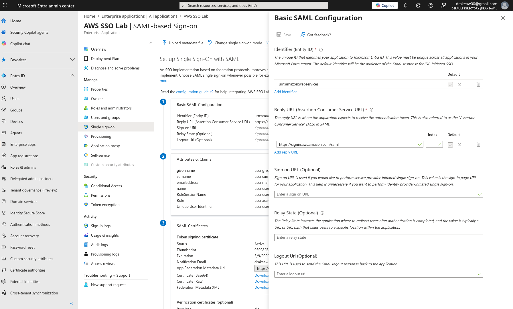
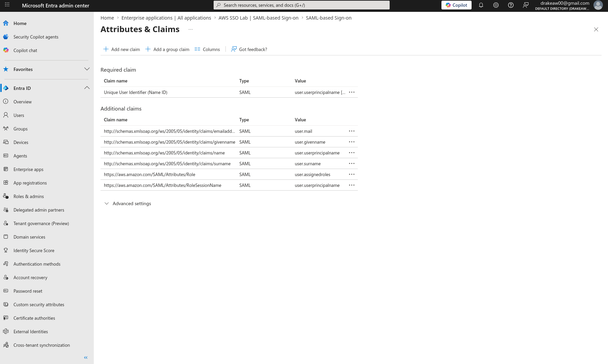
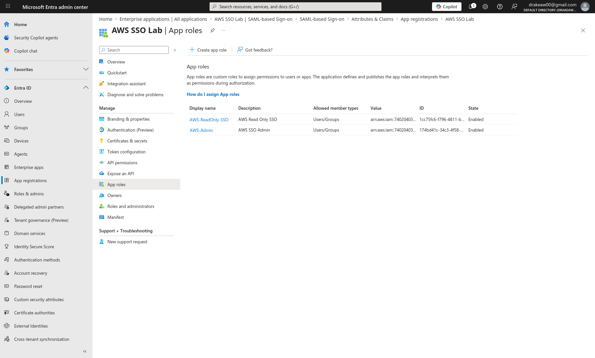
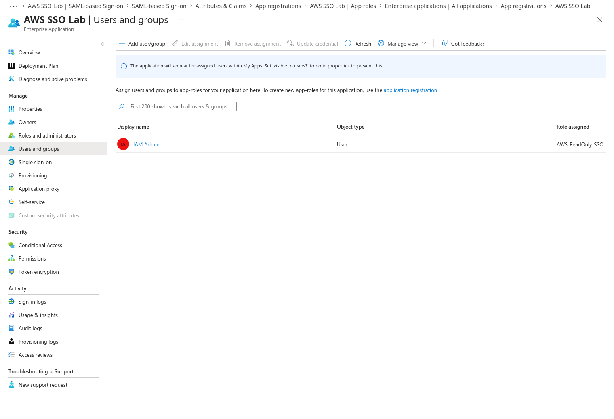
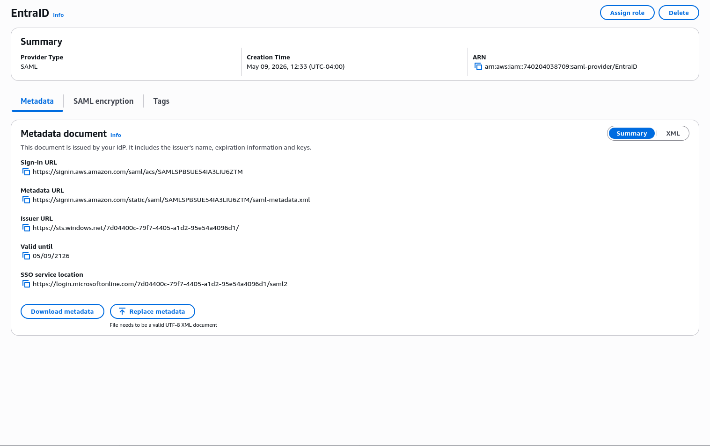
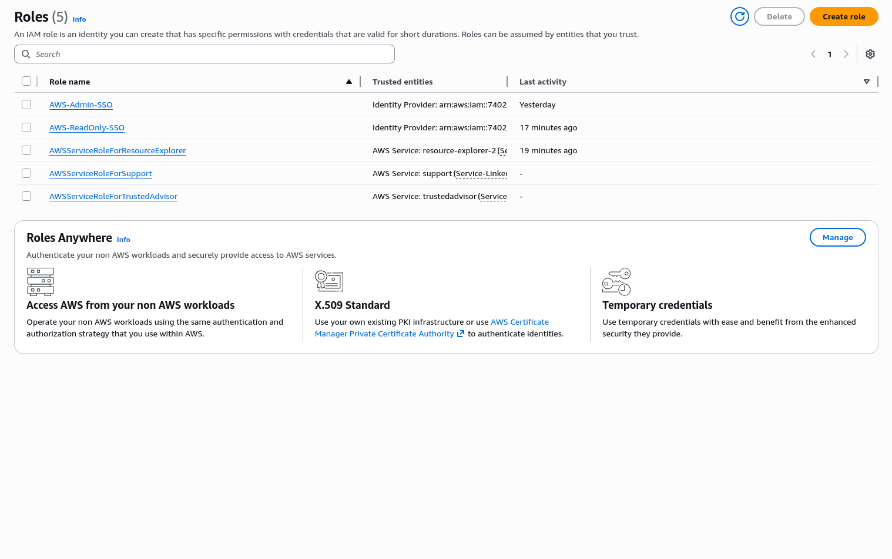
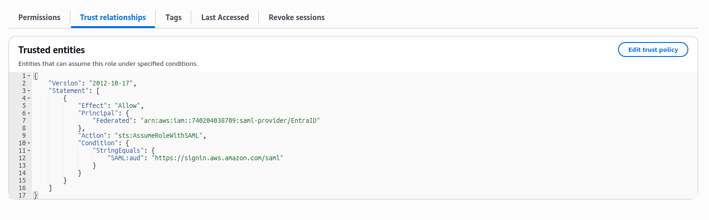
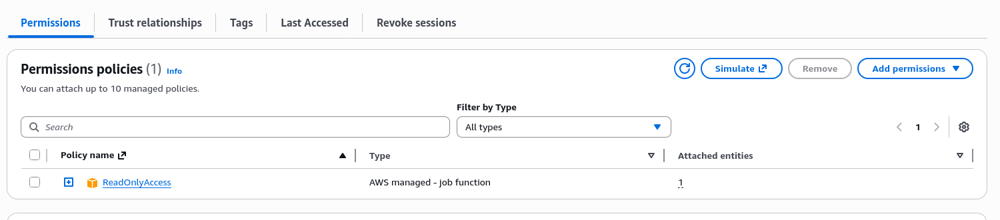
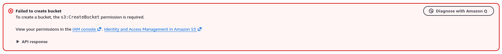

# AWS + Microsoft Entra ID SAML SSO Lab

## Overview
This project demonstrates a full end-to-end implementation of SAML 2.0 Single Sign-On (SSO) between Microsoft Entra ID and AWS IAM.

The focus of this lab is:
- Identity federation
- Role-based access control (RBAC)
- Least privilege enforcement
- Real-world troubleshooting of SAML authentication issues

---

## Architecture
User → Entra ID → SAML Assertion → AWS IAM Role → AWS Console

---

## Key Concepts
- SAML 2.0 Federation
- Identity Federation (Entra ID → AWS)
- RBAC (Role-Based Access Control)
- Least Privilege Principle
- IAM Trust Policies

---

## Implementation Steps

### 1. Entra ID Configuration
- Created Enterprise Application
- Configured SAML-based SSO
- Defined App Roles:
  - AWS-Admin
  - AWS-ReadOnly

---

### 2. Claims Mapping
Configured SAML claims required by AWS:

- `Role` → user.assignedroles
- `RoleSessionName` → user.userprincipalname

This enables AWS to map Entra users to IAM roles.

---

### 3. AWS Configuration
- Created SAML Identity Provider using Entra metadata
- Created IAM Roles:
  - AWS-Admin-SSO
  - AWS-ReadOnly-SSO
- Configured Trust Policy for federation:

```
"Condition": {
  "StringEquals": {
    "SAML:aud": "https://signin.aws.amazon.com/saml"
  }
}
```

---

## Validation (Least Privilege Enforcement)

### Test Performed:
Attempted to create an S3 bucket using the ReadOnly role

### Result:
Access Denied

```
s3:CreateBucket permission is required
```

### Outcome:
Confirms proper least privilege enforcement

---

## Troubleshooting & Issues Encountered

### 1. Incorrect Sign-On URL
- Issue: Used `console.aws.amazon.com`
- Fix: Must use:
```
https://signin.aws.amazon.com/saml
```

---

### 2. Missing / Incorrect SAML Role Claim
- Issue: AWS returned authentication error
- Root Cause: Role claim not properly mapped
- Fix:
  - Use `user.assignedroles`
  - Ensure exact ARN format:
```
arn:aws:iam::<account-id>:role/<role-name>,arn:aws:iam::<account-id>:saml-provider/<provider>
```

---

### 3. Claims Transformation UI Confusion (Entra)
- Issue: "Constant" option not available in UI
- Root Cause: UI changes in Entra portal
- Fix:
  - Used direct attribute mapping instead of transformation

---

### 4. Single Role Assignment Limitation
- Issue: Could not assign multiple roles
- Root Cause: Entra ID licensing restriction
- Fix:
  - Tested roles individually per user assignment

---

### 5. AWS Permission Policy Confusion
- Issue: Could not find ReadOnly policy
- Fix:
  - Use:
```
ReadOnlyAccess
```
  - AWS Managed Policy (not service-specific variants)

---

### 6. Trust Policy Errors
- Issue: Role assumption failed
- Root Cause:
  - Incorrect SAML audience
- Fix:
```
"SAML:aud": "https://signin.aws.amazon.com/saml"
```

---

### 7. SAML Login Fails with "No SAML Response"
- Issue:
AWS error page: "Your request did not include a SAML response"
- Root Cause:
  - Direct navigation to AWS SAML endpoint
- Fix:
  - Must initiate login from Entra (IdP-initiated)

---

## Security Concepts Demonstrated
- Identity Federation without storing AWS credentials
- RBAC using external identity provider
- Least privilege validation via real denial testing
- Trust boundary enforcement between IdP and AWS

---

## Key Takeaways
- SAML requires **exact configuration precision**
- IAM role mapping is highly sensitive to formatting
- Entra UI changes can introduce confusion in claim configuration
- Least privilege must be **validated, not assumed**

---

## Future Improvements
- Implement Conditional Access (MFA enforcement)
- Enable AWS CloudTrail logging
- Automate setup using Terraform
- Integrate AWS Identity Center (modern approach)

---

## Screenshots (Coming Next)
- Entra SAML configuration
- Claims mapping
- AWS trust policy
- Role assignment
- Access denied validation

---

## Screenshots

### Entra SAML Configuration


### Claims Mapping


### App Roles


### User Assignment


### AWS SAML Provider


### IAM Roles


### Trust Policy


### Read Only Policy


### AWS Federated Login


### Access Denied (Validation)

