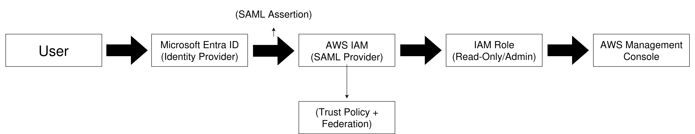

# AWS + Microsoft Entra ID SAML SSO Lab

## Overview

This project demonstrates a full end-to-end implementation of SAML 2.0 Single Sign-On (SSO) between Microsoft Entra ID and AWS IAM.

The focus of this lab includes:

- Identity federation (Entra ID → AWS)
- Role-Based Access Control (RBAC)
- Least privilege enforcement
- Real-world troubleshooting of SAML authentication issues

---

## Architecture



End-to-end SAML federation flow between Microsoft Entra ID and AWS IAM demonstrating role-based access control and least privilege enforcement.

---

## Key Concepts

- SAML 2.0 Federation
- Identity Federation (External IdP → AWS)
- RBAC (Role-Based Access Control)
- Least Privilege Principle
- IAM Trust Policies

---

## 1. Entra ID Configuration

- Created Enterprise Application
- Configured SAML-based SSO
- Defined App Roles:
  - AWS-Admin
  - AWS-ReadOnly


---

## 2. Claims Mapping

Configured required SAML claims for AWS role mapping:

- `Role` → user.assignedroles  
- `RoleSessionName` → user.userprincipalname  

This enables AWS to map Entra users to IAM roles dynamically.


---

## 3. App Roles

Defined application roles in Entra ID to represent AWS access levels:

- AWS-Admin  
- AWS-ReadOnly  


---

## 4. User Assignment

Assigned users directly to roles due to Entra licensing limitations preventing group-based assignments.


---

## 5. AWS SAML Provider

- Created SAML Identity Provider using Entra metadata  
- Established trust between AWS and Entra ID  


---

## 6. IAM Roles

Created IAM roles corresponding to Entra roles:

- AWS-Admin-SSO  
- AWS-ReadOnly-SSO  


---

## 7. Trust Policy

Configured trust relationship to allow SAML federation:

```json
{
  "Effect": "Allow",
  "Principal": {
    "Federated": "arn:aws:iam::<account-id>:saml-provider/EntraID"
  },
  "Action": "sts:AssumeRoleWithSAML",
  "Condition": {
    "StringEquals": {
      "SAML:aud": "https://signin.aws.amazon.com/saml"
    }
  }
}
```


---

## 8. Read-Only Policy

Attached AWS managed policy:

- `ReadOnlyAccess`

Ensures users can view resources but cannot modify them.


---

## 9. Federated Login

Successfully authenticated via Entra ID and accessed AWS Console using SAML federation.


---

## 10. Validation (Least Privilege Enforcement)

### Test Performed:
Attempted to create an S3 bucket using the ReadOnly role

### Result:
Access Denied

```
s3:CreateBucket permission is required
```

### Outcome:
Confirms proper least privilege enforcement


---

## Troubleshooting & Issues Encountered

### 1. Incorrect Sign-On URL
- Issue: Used incorrect AWS login URL  
- Fix:
```
https://signin.aws.amazon.com/saml
```

---

### 2. Missing / Incorrect SAML Role Claim
- Issue: Authentication failure  
- Root Cause: Improper claim mapping  
- Fix:
  - Use `user.assignedroles`
  - Ensure exact ARN format for role + provider  

---

### 3. Claims Transformation UI Confusion (Entra)
- Issue: Missing transformation options  
- Root Cause: UI changes in Entra portal  
- Fix: Used direct attribute mapping instead  

---

### 4. Single Role Assignment Limitation
- Issue: Could not assign multiple roles  
- Root Cause: Entra licensing limitation  
- Fix: Assigned roles individually per user  

---

### 5. AWS Policy Confusion
- Issue: Could not locate correct ReadOnly policy  
- Fix:
```
ReadOnlyAccess
```
(AWS Managed Policy)

---

### 6. Trust Policy Errors
- Issue: Role assumption failed  
- Root Cause: Incorrect SAML audience  
- Fix:
```
"SAML:aud": "https://signin.aws.amazon.com/saml"
```

---

### 7. "No SAML Response" Error
- Issue: AWS returned error when accessing directly  
- Root Cause: Direct navigation to AWS SAML endpoint  
- Fix: Must initiate login from Entra (IdP-initiated)

---

## Security Concepts Demonstrated

- Identity federation without storing AWS credentials  
- RBAC using external identity provider  
- Least privilege validation via denial testing  
- Trust boundary enforcement between Entra ID and AWS  

---

## Key Takeaways

- SAML requires exact configuration precision  
- IAM role mapping is highly sensitive to formatting  
- UI changes in Entra can impact configuration workflows  
- Least privilege must be validated, not assumed  

---

## Future Improvements

- Implement Conditional Access (MFA enforcement)  
- Enable AWS CloudTrail logging  
- Automate deployment using Terraform  
- Integrate AWS Identity Center  
